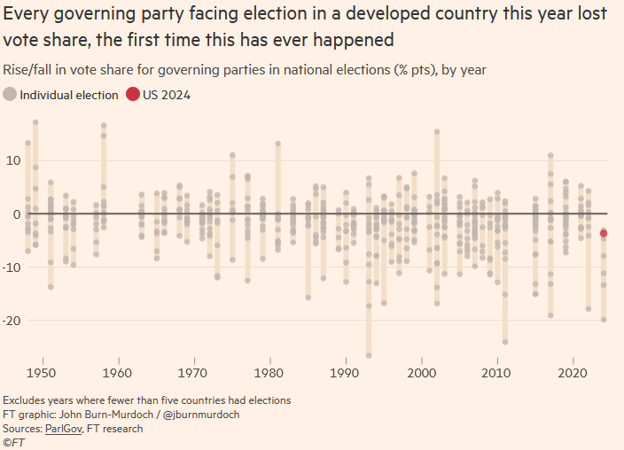
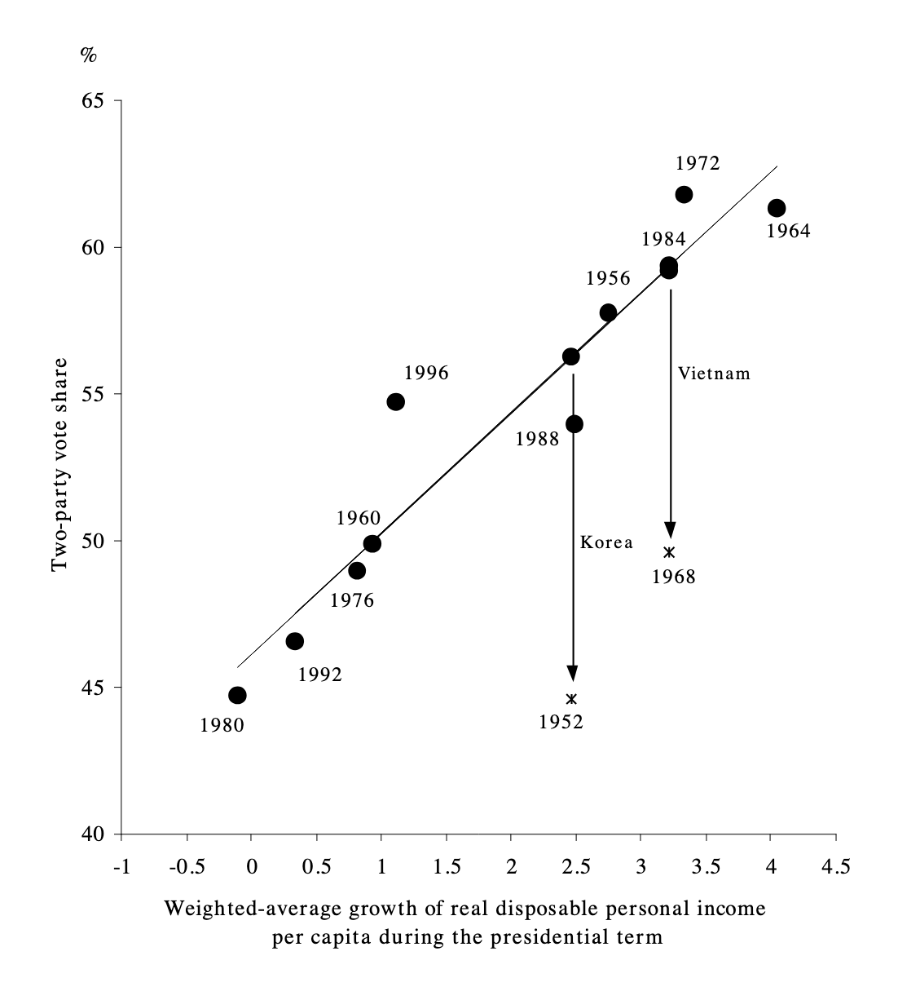

(⏱️ *~10 min read*)

Another month, another collection of shiny objects (stuff I found in the the past month that were valuable/inspiring).

See also, previous Signal Boosts for [Oct/Sep](../signal-boosts-oct-2024/), [Aug/July](../signal-boosts-aug-2024/), [June](../signal-boosts-june-2024/), [May](../signal-boosts-may-2024/)

1. 🩸 Kurzgesagt gets to the bottom of a science myth [↪](#blood)
2. 😭 Paper: AI poems are now "more human than human" [↪](#poem)
3. 🇺🇸 U.S. Election-related analysis [↪](#election)
4. 👄 The Substance [↪](#substance)

---

## 🩸 Kurzgesagt gets to the bottom of a science myth

> “If you were to lie your blood vessels out entirely from end-to-end, ~~you would die~~ it would stretch 100,000 km, wrapping twice across the globe!”

It's not just a popular factoid, it's found in university lectures & scientific papers! So it must be tr--

--wait, that paper didn't give a source. Ok, *this* one gives a source, but its source just says the "fact" without giving a source. Uh oh.

This is the story of how Kurzgesagt went on a deep, *deep* rabbit-hole to track down a source for *one* (very popular, even "official") science-myth!  I like this video because:

1. It exemplifies the virtue of rigorous scholarship, the thankless task of factchecking;
2. It's a cautionary tale of how the telephone-game of "facts" can infect even the so-called official sources; and
3. Their half-real-life-half-animation style for this video is *so* adorable!

Check it out! You'll also learn the *real* answer for how long your blood vessels are in total. It's not as impressive as "can wrap twice around the world"... but it's still pretty dang long!

10-minute video (not counting credits):

<iframe width="640" height="360" src="https://www.youtube-nocookie.com/embed/bgo7rm5Maqg?si=4mnRfK5jTYobTqp-&rel=0" title="YouTube video player" frameborder="0" allow="accelerometer; autoplay; clipboard-write; encrypted-media; gyroscope; picture-in-picture; web-share" referrerpolicy="strict-origin-when-cross-origin" allowfullscreen></iframe>

---

## 😭 Paper: AI poems are now "more human than human"

Poets speak to the human condition, and the human condition has spoken back: they prefer the autocomplete.

From [Porter & Machery 2024](https://www.nature.com/articles/s41598-024-76900-1): (emphases added)

> We conducted two experiments with non-expert poetry readers and found that participants performed **below chance** levels in identifying AI-generated poems (46.6% accuracy)
> 
> \[...\] participants were **more likely to judge AI-generated poems as human-authored** than actual human-authored poems
> 
> \[...\] We found that AI-generated poems were rated **more favorably in qualities such as rhythm and beauty**, and that this contributed to their mistaken identification as human-authored.

And the human poems were from famous poets across eras & genres (from Chaucer to Whitman to Plath). And the AI poems were the *first five* poems generated by ChatGPT with an unoptimized prompt, no cherry-picking.

That's... pretty damn damning.

Like the original Turing Test, I'm not sure how much of this is "AI has gotten too good" versus "Humans have gotten too gullible".

(See also: Astral Codex Ten's ["AI Art Turing Test"](https://www.astralcodexten.com/p/how-did-you-do-on-the-ai-art-turing), where humans (on avg) *also* preferred AI art over human art when they think it's human. Although, 2 major differences from ACX's study vs the above: 1) ACX's test *did* cherry-pick the AI art, and 2) Even then, humans *were* slightly better than chance (~60%) at detecting AI art.)

---

## 🇺🇸 U.S. Election-related analysis

My political alignment is "why would any sane person try to compress their beliefs into one or two dimensions, just ask me my thoughts on an issue-by-issue basis". But if I *had* to pick an approximation, sure, put me down somewhere between left & libertarian.

And so, like many in the left/libertarian circles, while I wasn't *shocked* Trump won again, I was disappointed. Sure, America's institutions are broken a.f., but Americans deserve a better solution than *that* guy. (I'm a Canadian citizen, so I could not vote in the States. But Canada shouldn't be so smug; the political culture of Canada, and most Western countries, are IMHO only a decade behind America's.)

It's tempting to interpret whatever happens as evidence for everything I already believed, so, here's a Signal Boost highlighting data & analyses that *were* surprising to me:

1\) The **[Associated Press VoteCast, a survey of 110,000+ voters](https://apnews.com/projects/election-results-2024/votecast/).**

The biggest surprise to me: Trump made the most gains amongst *Blacks, Hispanics, 18-29 year olds, and non-college folks*. Meanwhile, it was *white urban highly-educated men* who Harris gained ground on:

(Hat tip [to Nick Sweeting](https://docs.monadical.com/s/so-you-want-to-build-a-social-network) for being the first to show me this dataviz. Note 1: these are *relative* percentages, not *absolute* percentage-points ([relevant xkcd](https://xkcd.com/985/)). Note 2: I couldn't find *who* made the above dataviz, but it does accurately show the AP VoteCast data.)

So, I think this is evidence against "Trump won because of racism or Boomers".

. . .

2\) **["7 Lessons I Didn't Learn From Election Day"](https://ericneyman.wordpress.com/2024/11/14/seven-lessons-i-didnt-learn-from-election-day/) by Eric Neyman** (found through [the Manifold Markets newsletter](https://news.manifold.markets/)) 

The biggest insight I got from that post: **for the first time *ever*, incumbent parties in *every developed country* got their asses kicked this year.**  If anything, Harris did really well, for a representative of the incumbent party:

So, I think this is evidence against "The world is shifting right". (The UK Labour Party resoundingly beat the Tories)

However, this is probably evidence for "It's the economy, stupid".

(Although, I note I'm confused: [2022 was *worse* inflation-wise than 2024](https://www.bls.gov/charts/consumer-price-index/consumer-price-index-by-category-line-chart.htm), yet as seen above, incumbents did ok in 2022? Democrats avoided a "red wave" in 2022 midterms. Is it wages relative to inflation? No, [wages outgrew inflation starting Feb 2023](https://www.statista.com/statistics/1351276/wage-growth-vs-inflation-us/). Maybe it's not the *actual* economy, but people's *perception* of the economy that matters? No, [consumer confidence was also *worse* in 2022](https://www.oecd.org/en/data/indicators/consumer-confidence-index-cci.html). Maybe Roe v Wade being overturned helped the Dems in 2022? Maybe, but it doesn't explain why most incumbents around the world *also* held in 2022.)

. . .

2.5) Not directly related to the 2024 election, but "It's the economy, stupid" reminded me of Douglas Hibb's famous **[Bread & Peace Model](https://gupea.ub.gu.se/bitstream/handle/2077/2847/gunwpe0020.pdf?sequence=1)**, which found that "does the incumbent win the election" is pretty much determined by real income growth since the last election cycle, with exceptions for major wars:

From the paper, to rub salt in the wounds of all pundits & political scientists:

> The model is subjected to robustness tests against twenty-two variations \[...\] inspired by the extensive literature on presidential voting. Not one of these variations adds value to the Bread and Peace model\[.\]

(I haven't done enough research yet to tell if the Bread & Peace model holds for other countries. The above paper was published before the 2000 US election, but [Bread & Peace mostly held up since then.](https://files.osf.io/v1/resources/xrf3t/providers/osfstorage/5f7581b81cfe6900b0cefd24?action=download&direct&version=7))

(Thinking aloud: Hm... maybe the Israel-Hamas war explains why the incumbent did worse in 2024 than 2022, even though the economy's better in 2024 than 2022? Then again, 2022 was also the start of the Russia-Ukraine war. Hm.)

. . .

3\) Sick of numbers? Here's a good *qualitative* look at **[immigrant conservatives in Hawaii](https://x.com/smquinsaat/status/1854187349456171179), fieldwork by Sharon Quinsaat.** A few highlights, on why (these) Hawaiian immigrants went for Trump:

1. It's the economy, stupid. (They feel Dems "sold us out")
2. At the risk of sounding condescending, their media sources actually *are* really wacky. Like, "Trump is a demi-god" celebrity-worship wacky.
3. Payback. "I'm voting Republican just to stick it to the Democrats." 

. . .

4\) **[Ezra Klein](https://podcasts.apple.com/us/podcast/the-ezra-klein-show/id1548604447)**, as usual, is pretty good. I've only listened to few of his post-election podcasts so far, but here's my main takeaways:

* The old left-right spectrum is pretty much dead.
	* (Trump is anti-free trade & pro-tariffs. His Health Secretary pick, RFK Jr., is pro-choice. Who, 10 years ago, woulda thought a Republican president would do *that?*)
* The new political divide is something along the lines of:
	* Pro-institution, vs Anti-institution ("we're sick of experts")
	* The college-credentialed/professional class ("trust science!"), vs everyone else
* The Democrats failed, and *institutions* failed, because of "cover your ass" & not wanting to be the messenger with bad-news messages. (e.g. staffers ignoring Biden's declining sharpness, the "noble lies" during the pandemic)

Ezra is someone who wants to critique institutions, *because* he wants them to get better. I'm reminded of this quote:[^quote-source]

> The iron rule of politics is that if there are real problems in society and responsible parties don’t deal with them, the irresponsible parties will jump on them.

[^quote-source]: Quote from Daniel Schwammenthal, director of the American Jewish Committee’s Transatlantic Institute. Learnt about this quote [from this article by Richard Reeves](https://ofboysandmen.substack.com/p/into-the-vacuum-demons-pour), on why neglecting real issues that disproportionally affect males (men are more likely than women to be homeless, die of suicide, drop out of school, etc) led to the rise of grifters like Andrew Tate.

. . .

In sum, my current thoughts (subject to future change, of course):

1. "Bread & Peace model" probably holds. It's the economy, stupid.
2. Incumbents everywhere are falling, whether they're left or right. (Tories lost UK *hard*.)
3. The old "left-right" spectrum is dead. (It seems even racial/gender identity is getting much *less* politically salient in the US, with Black/Latino voters swinging to Trump.)
4. The new spectrum is "pro vs anti traditional institutions". (universities, journalism, government, international orgs, etc)
5. Institutions everywhere are failing because of "cover your ass" bureaucracy.

I don't have concrete suggestions. Only this:

Deal with the real problems in institutions you care about — *or the irresponsible parties will jump on them.*

---

## 👄 The Substance

A few weeks ago, I got a email saying I was turned down for a research gig, which was understandable — but it hit some of my insecurities that [now that I'm 30](TODO), I'm too old for great research, and I oughta be replaced with someone younger. ([relevant xkcd](https://xkcd.com/447/))  So, to get my mind off my worries, I went to see the new movie **The Substance**, which I knew nothing about. It turned out to be a sci-fi satire body-horror-comedy, about a woman who's insecure that she's too old, and she'll be replaced with someone younger.

Aaaaaaaaa

<u>My quick review</u>: Honestly the plot's straightforward & predictable, and not exactly subtle about its themes of sexism in industry + obsession with youth/fame + self-sabotaging self-loathing. But, I have a high tolerance for camp (*loved* Rocky Horror), and this film happened to hit me at the *exact* moment I needed to confront my insecurities that I'm too old & I'll be replaced with someone younger.

Because, yeah, I *am* being silly. Tolkien was 45 when he started writing The Lord of the Rings, Andrew Wiles proved Fermat's Last Theorem between age 36 to 41. Sure, my probability of doing great work gets *lower* over time, but it's not zero.

Also, the fact this movie features Demi Moore, who's still smokin' hot at age 62, makes this a movie that *disproves its own premise*, in a good way! You *can* age with confidence & style.

Seriously, gott dayumn, Demi:

★★★★☆: Recommended if you need to confront your insecurities, via a campy body-horror movie starring a hot MILF. Also the cinematography & [: the soundtrack](https://www.youtube.com/watch?v=tKxKuYsx2R0) *kicks ass*.

(Tangentially related: while reading Demi Moore's Wikipedia article, I learnt she co-founded [Thorn](https://en.wikipedia.org/wiki/Thorn_(organization))?! I knew about Thorn, because I'm getting into AI Safety/Ethics research, and one of Thorn's famous projects is using AI to help automatically flag child abuse material! \[[read more here](https://www.artificialintelligence-news.com/news/ai-tool-detect-child-abuse-images-accuracy/)\] Good work, Demi!)

