I gave a mini-talk [at XOXO 2024](http://web.archive.org/web/20240825055310/https://xoxofest.com/2024/schedule/art-code/), the *final* XOXO! Alas, these mini-talks weren't recorded, so here's my slides & speech notes. I hope the ideas in this talk/post are helpful for you, and help you think more fruitfully about AI, art, and "AI art"!

## The Creative Cyborg: or, How do we keep art human in the face of AI?

`<BEGIN_TALK>`

(I walk on stage.)

(inhale)

(screaming into microphone:)

*A...*

*I!!!*

Yes, it's yet another obligatory AI talk.  I apologize.

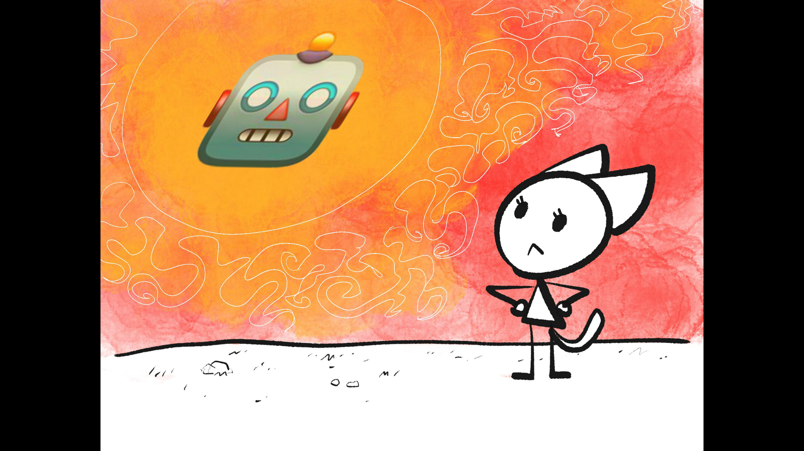

Anyway, as you all know way too well, for the last couple years we've all been haunted by this... *Majora's Mask entity* of more and more powerful AI. Oh God, it's coming down to get us, aaa, what do we do. Sure, it's not *the* most messed-up thing that's happened in the last 5 years since the previous XOXO... but it's, Top 5, maybe?

So, there's two levels of problem, regarding AI.

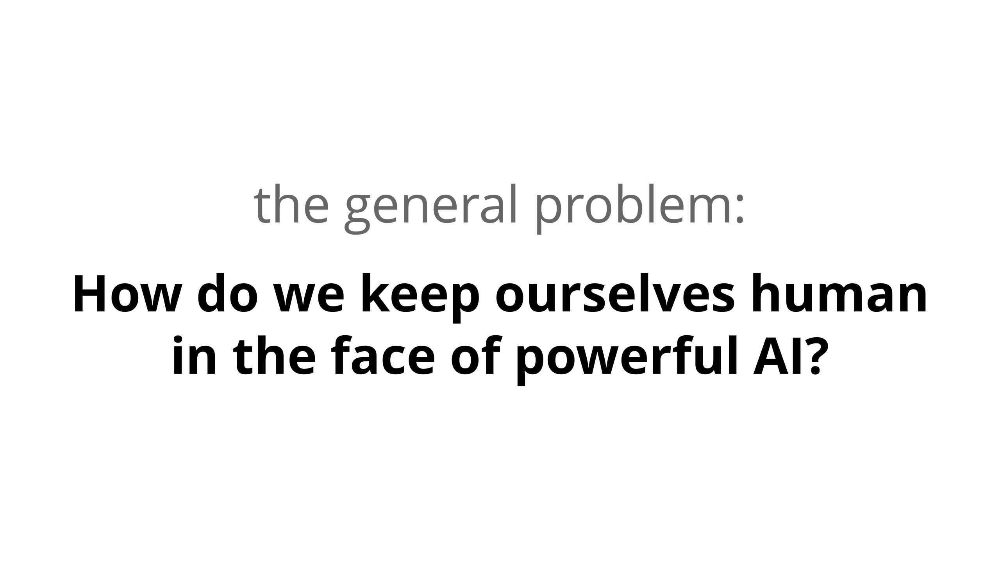

And, for us internet artists here at XOXO,

Yes we're all sick of these discussions, but we *do* still need to figure it out. But it's painful to stare directly at the sun... so, like that cool eclipse that happened a few months ago, we're going to need some *special lenses.*

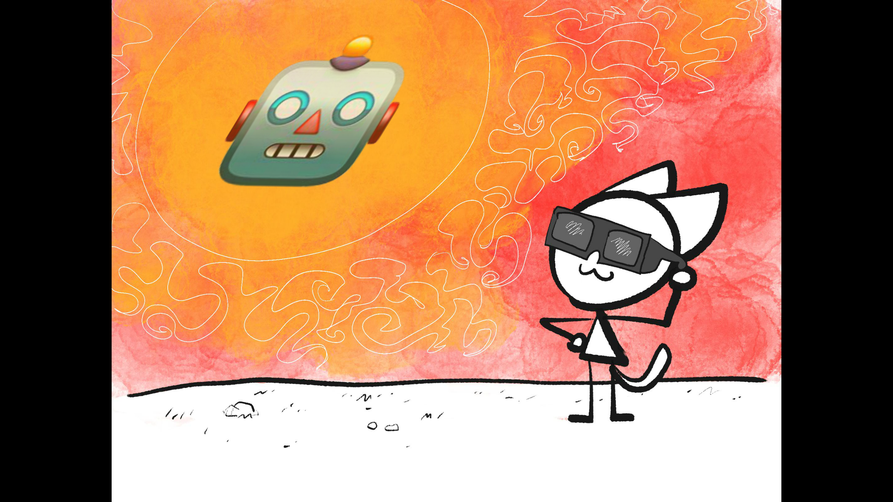

Here's *three* lenses that helped *me* think more fruitfully about AI, that I hope may help you too:

These lenses apply to AI in general, but since I only have 15 minutes and this is XOXO, let's focus on the sub-problem of AI & Art.

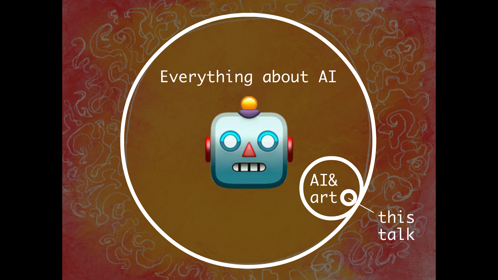

More specifically, the *art* part of art, putting aside the other important issues of copyright, economics, technical problems, etc.

So, let's think step by step:

## Lens One:

*(silence as I wait for folks to read this next slide:)*

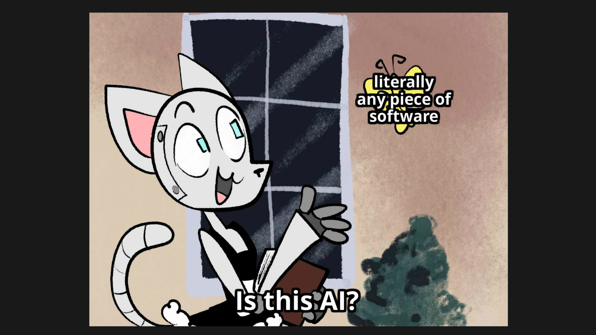

The first step to thinking clearly, is to ditch hype words that don't mean anything. "AI" doesn't mean anything. So, let's just use a plain, boring word, like "automation".

On one hand, yay it feels good to pop the tech industry's hype bubble. On the other hand, this re-frame made me realize: *we artists already use lots of automation.*

Let's consider a spectrum of tools, from "most artists approve of this" to "most artists disapprove".

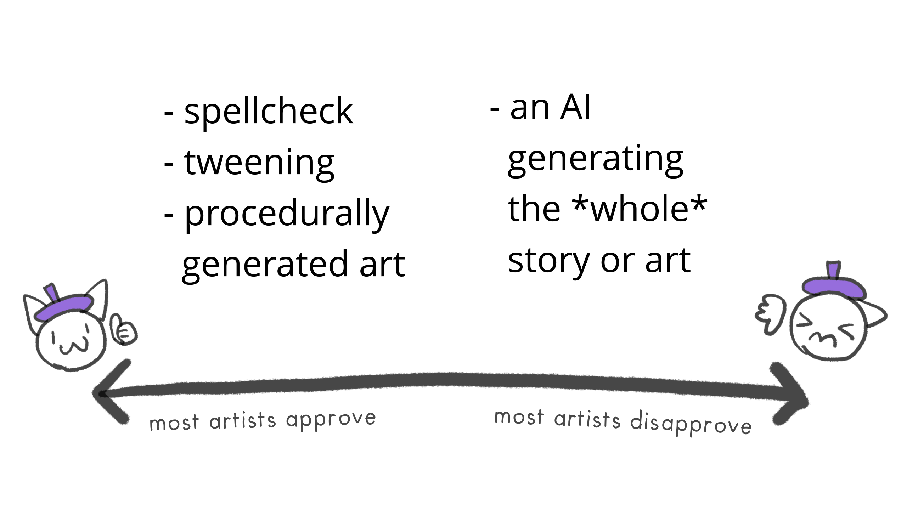

In writing: everyone's fine with *automated* spellchecking, formatting, copy-paste, word count, etc.

In animation: most folks are fine with *automated* tweening, blending modes, 3d rendering, simulated physics, etc.

In some cases, the automation *is* the art! Consider [Darius Kazemi](https://en.wikipedia.org/wiki/Darius_Kazemi)'s weird bots, [Kate Compton](http://www.galaxykate.com/)'s procedural art, or Neal Agarwal's game [Infinite Craft](https://en.wikipedia.org/wiki/Infinite_Craft), which uses a language AI to generate infinite-ish possibilites.

So most artists support *some* automation. But on the other hand, most of us — including myself — don't want an AI to write a *whole* story, or animate a *whole* film.

So between those extremes, where do we draw the line?

It'd be a *massive* coincidence if I just *happened* to be born at the time when all automation *I* grew up with is fine, but any automation *after* that isn't. If *that* was my line, a pro-AI-Art person could, *correctly*, accuse me of being... this:

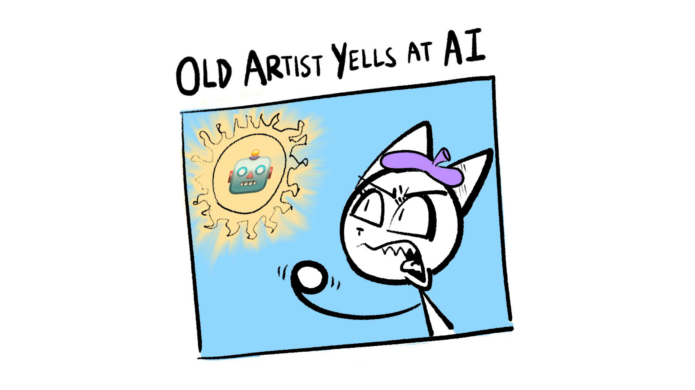

So *am* I being "Old Artist Shakes Fist At New Tech"?  *Are* my instincts any different from folks who said electronic music isn't real music, or folks who said videogames can't be art?

So: is there a more *principled* way to draw the line, between what kind of automation helps or hurts the artistic spirit?  I think so!  Which brings me to my second lens...

## Lens Two:

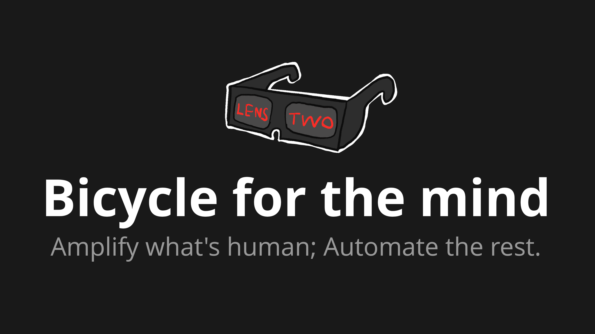

In the field of "human-computer interaction", there's a famous idea:[^quote]

[^quote]: Paraphrase of a recurring motto Steve Jobs used to say. [Scan of his 1980 Wall Street Journal ad](http://web.archive.org/web/20240902210345/https://miro.medium.com/v2/resize:fit:1400/format:webp/0%2ASgDLtymZpgcXEA7A)

>

What does that mean? Well, like all vehicles, a bicycle gets you from point A to B. But *unlike* most vehicles, a bicycle is 1) *powered* by a human, and 2) *makes the human stronger.*

Minds are like muscles: *use it or lose it*. If our tools don't *use* our human strengths, *we lose it*.

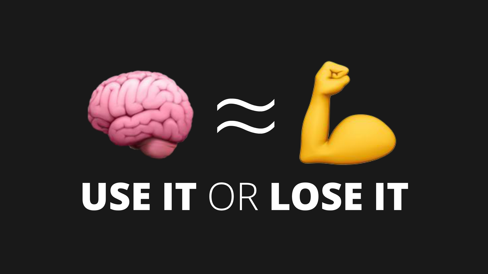

*That's* the line I draw for automation in art:

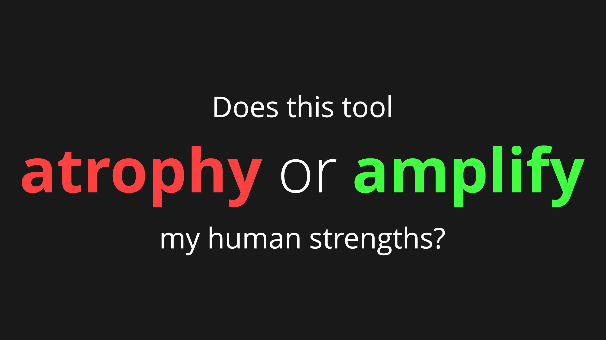

Or, another quote-worthy way of putting it:

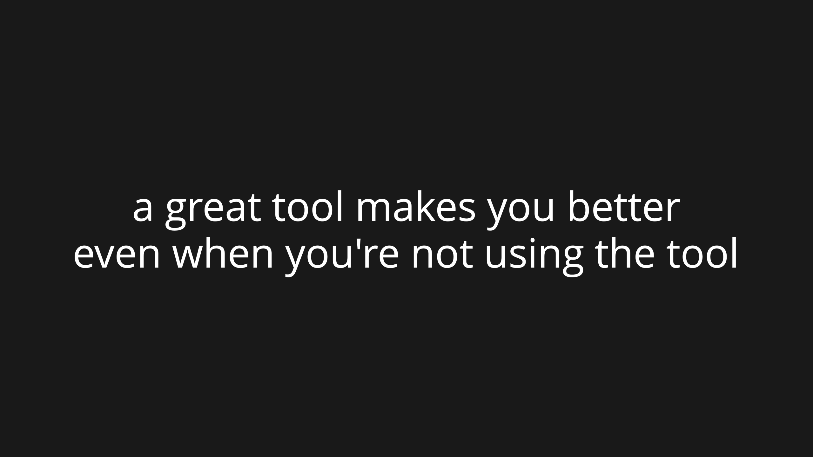

So. Let's apply this!

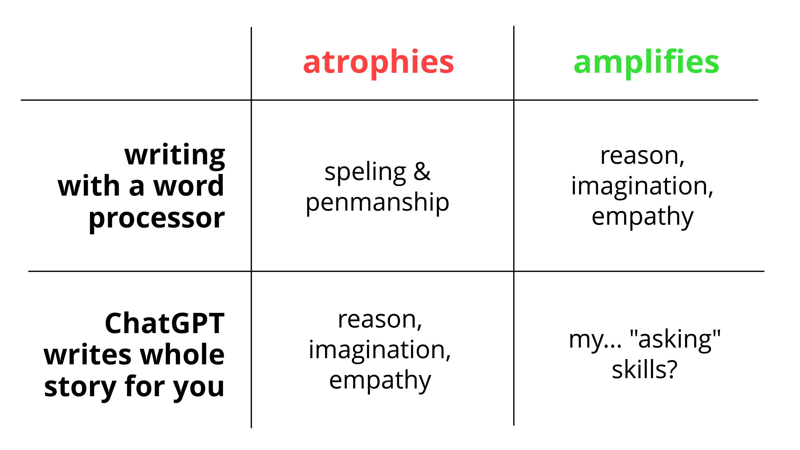

Consider word processors, like Microsoft Word or Google Docs. Yes, using word processors will cause atrophy to my speling & penmanship. But I'm not trying to win a spelling bee, I'm trying to write a moving story. The *less* I can worry about spelling, the *more* I can focus on using the mind-muscles that matter most to *me*: reason, imagination, empathy.

In contrast, asking ChatGPT to write a whole story for me, does *not* engage those mind-muscles. It only engages my... "asking" skills? Sorry, "prompt engineering". `[uproarious audience laughter]` `[really i swear]`

Point is: *this is NOT neutral on my mental muscles*: if I don't use it, I *will* lose it. I'll *lose* my reason & imagination & empathy.

But: preaching, choir. Y'all here probably already agree. So let's try a question that's harder for *this* crowd:

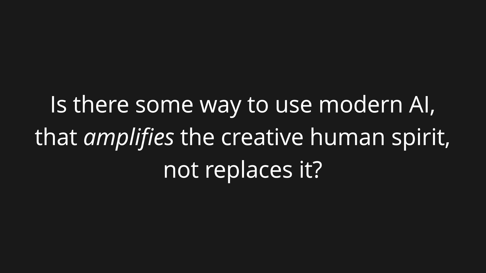

That is: if big tech is headed towards "Replace us", and the opposite reactionary urge is "Keep us exactly the same", what does the *perpendicular* direction, "Enhance us", look like?

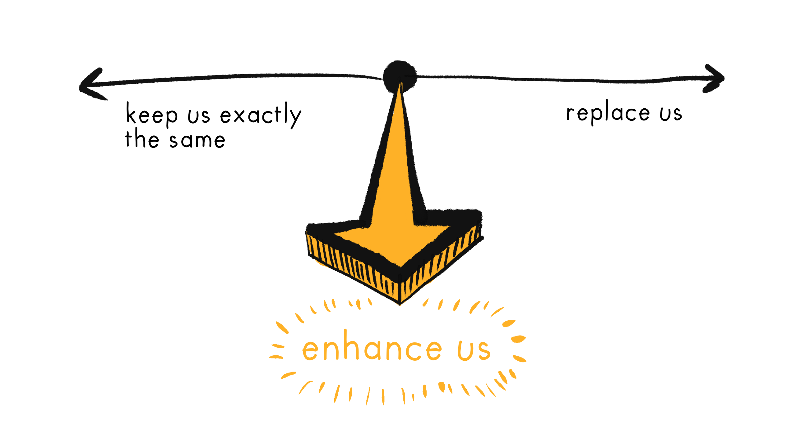

So: let's think of some concrete ways AI can *enhance* my creativity, not replace it!

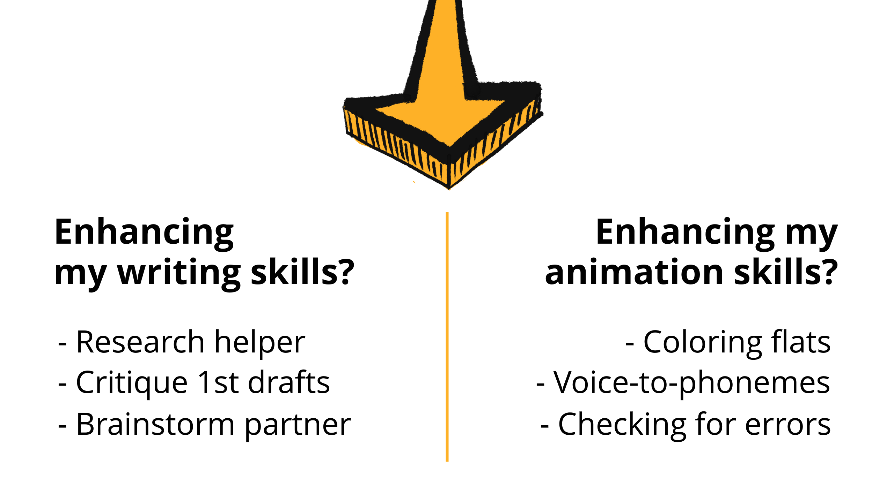

Now, I do writing. Personally, *I* will not use ChatGPT (or similar) to write *any* of my final pieces' words, or even the drafts. But! I've fruitfully used AI to:

1. Do research — yes, AIs "hallucinate", but so does Wikipedia.
2. Critique my first drafts, to catch the major flaws, before I bother human friends with it.
3. Be a brainstorming partner, but I *reverse* the usual role of the AI: the chatbot asks *me* questions, which will sharpen my thinking *even when I'm not using the bot.* It *strengthens* me. This tool makes me better *even when I'm not using the tool.*

I also do animation! Personally, *I* want the character designs and the animation to still be *me*. But! Here's some tedious stuff I'd *like* AI to automate away:

1. Coloring the exact same flat colors for a moving character, 24 times per second.
2. Breaking down a whole voice track into exact phonemes (mouth-shapes) a character should make.
3. Checking for continuity errors, or if my drawings are off-model.

Those are all tedious tasks with no creativity, so I'm fine automating all that.

Some of these ideas are already plugins, some of these are beyond the capabilities of current AI. But, whether or not *these* specific ideas will work, my general principle stands:

(Claps hands) And there we go, problem 100% solved! Not. I *wish* this was a clear, unambiguous rule, but it's of course it's not. So for the sake of honesty, here's some things I'm undecided about, if they "cross the line" for me:

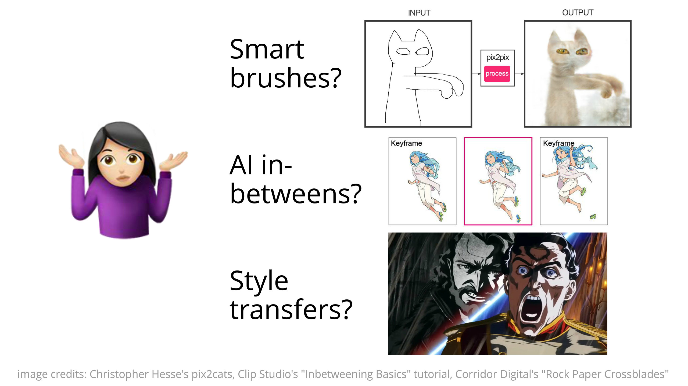

* **Smart brushes.** Draw a rough outline, AI fills it in with your art style. Is this tacky, or just an upgrade from Photoshop brushes?
* **AI animating in-between frames.** How much creative expression is lost from this? But is it any different from good ol' tweening?
* **Style Transfers.** (or automatic rotoscoping) A year ago, Corridor Digital made a parody anime, which used AI to convert their live-action video to anime style. [This was controversial](https://screenrant.com/ai-anime-corridor-crew-disney-animators-react-video/) & I was weirded out by it, but I can't think of why this would be "cheating", but motion capture (The Last of Us) or digital puppetry (Dog of Wisdom) isn't.

I dunno. I look forward to y'all's very *animated* discussion about where *you* personally draw the line.

But still, as a first-draft rule, "Amplify what's human, Automate the rest", ain't bad.

Which leads me to my final lens...

## Lens Three:

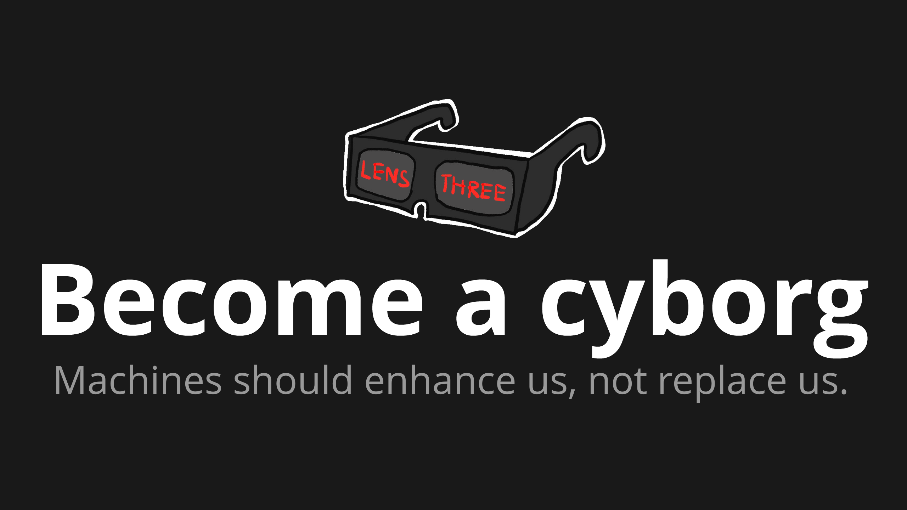

*A cyborg?* I hear you cry. *But then we won't even be human!*

Do you feel that way about folks with pacemakers? Their hearts are literally half-machine. And so what? Heart's just a pump made of meat. And what about glasses, prosthetic limbs, hearing aids, implants, birth control, hormones, joint replacements, piercings, and so on?

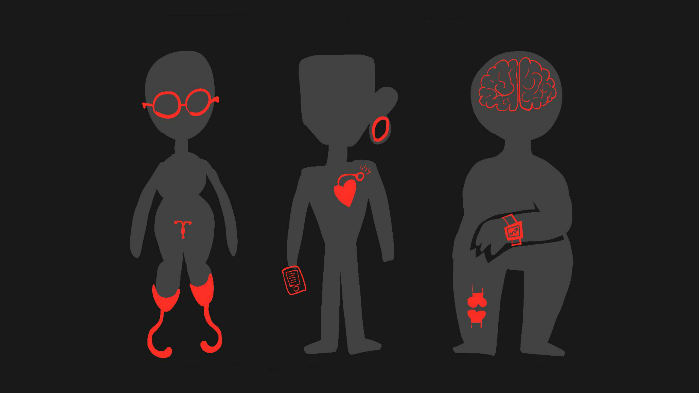

My friends:

*We're all already cyborgs.*

We've *always* extended ourselves with our tools.

And that's just our *bodies*!  Everyone's *minds* here are already augmented with this one technology: writing. (And writing *is* a technology, lest you forget. It's still tech even if it was invented before you were born.) Writing affects our minds so much, neuroscientists can even detect how it changes *our brain's anatomy*.[^brain-on-literacy]

[^brain-on-literacy]: Kolinsky et al 2014, [“The impact of literacy on the language brain areas”](https://www.jle.com/en/revues/nrp/e-docs/linfluence_de_lapprentissage_du_langage_ecrit_sur_les_aires_du_langage_302592/article.phtml)

So: is becoming a cyborg an affront to human nature? No:

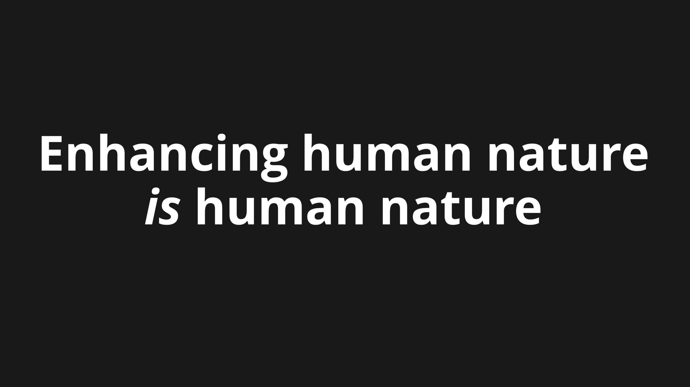

(pause)

...(and also crow nature, and elephant nature, and octopus nature, and dozens of other animals which use tools.)

(Also, to be clear, I'm using "cyborg" as a metaphor for enhancing yourself. You don't *actually* need to stick wires in your head. I mean, I ain't gonna cyborg-shame. What you do in the privacy of your skull is between you & your neurosurgeon.)

Anyway, point is:

We humans have severe flaws, so we can't stay the same. But we've got parts we value, so I don't endorse full replacement either. So, we need to go *perpendicular*, and seriously think about how to enhance ourselves, the bicycle for the mind, the creative cyborg.

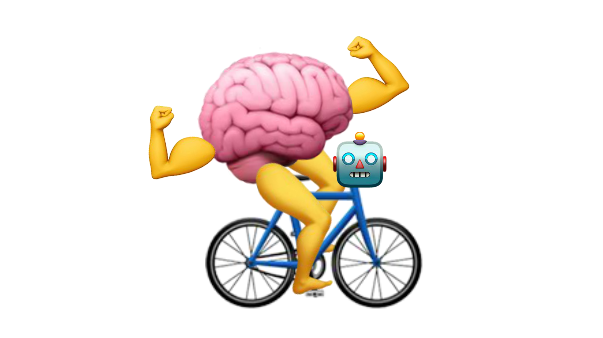

Back to our specific, and general problems:

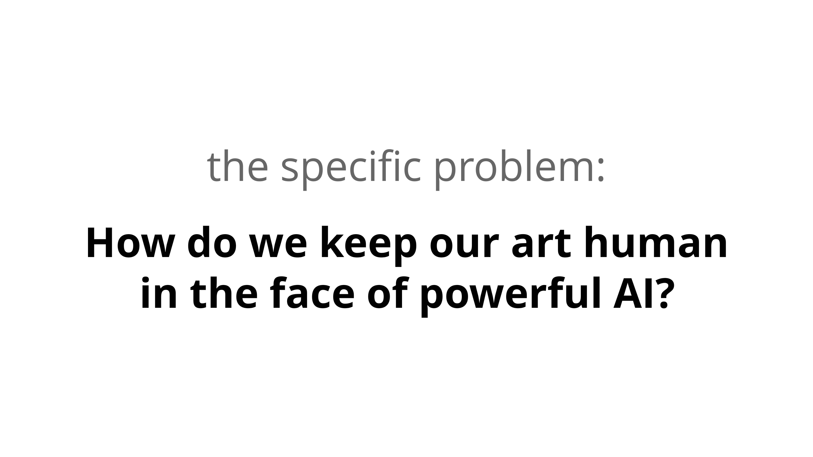

I dunno! But I'll guess it'll look like games that *subtly* use AI like *Infinite Craft*, or chatbots for brainstorming & research, or AI that can paint flat colors frame-by-frame for my animations because that is *so* tedious and annoying.

*Amplify what's human, automate the rest.*

That principle may even extend to...

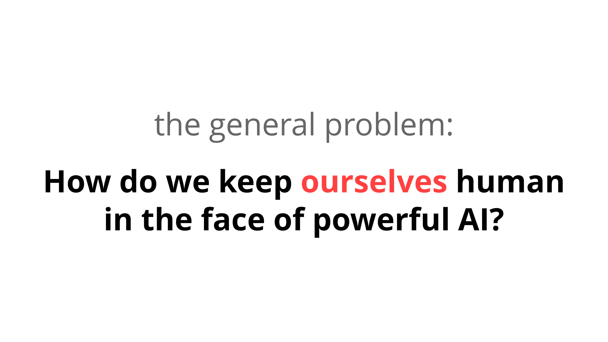

One idea for keeping human values at the centre of AI system, is to just... *literally put humans* in the centre of AI systems. *Keep the human at the center of our tools.*

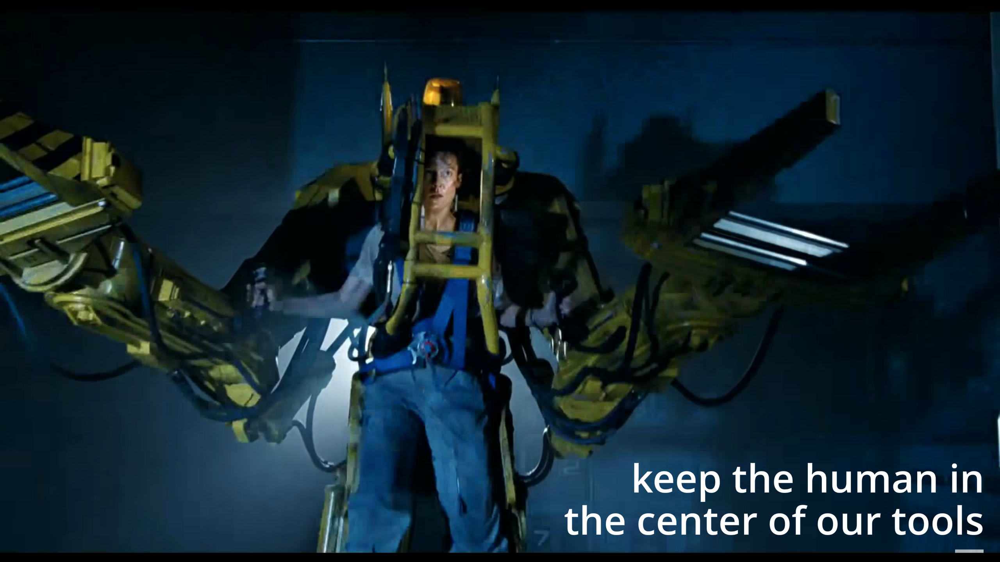

Don't give AI its *own* agency; instead, give us a large suite of tools that enhance *our* agency... like we always have, with writing, calculators, bicycles, and more.

(Clap hands) Tada, aligning AI to human values... solved!

Well, not really. A subtle problem with this idea, of "keeping the human in the center of our tools", is this: Our tools can *modify* our values.

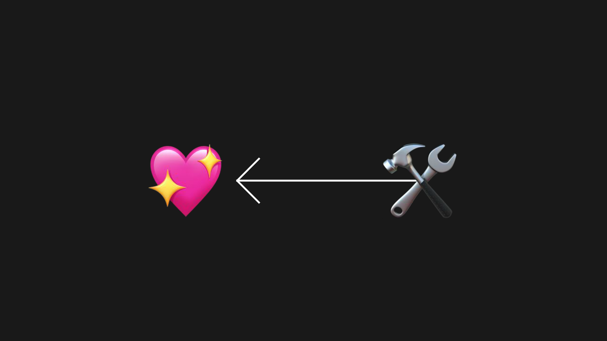

By analogy, consider writing. Anthropologists mostly agree: cultures with writing aren't just "cultures plus writing". Written Cultures grow to have *different* values from Oral Cultures, for better and worse.

Likewise, cultures with AI won't just be "cultures plus AI". These tools *can* modify our values, again, for better and worse.

But: one hopeful difference. Unlike the inventors of writing, who were just trying to collect taxes & record crops, *we* are aware that our technology can change our values. But also, that our values can change our technology.

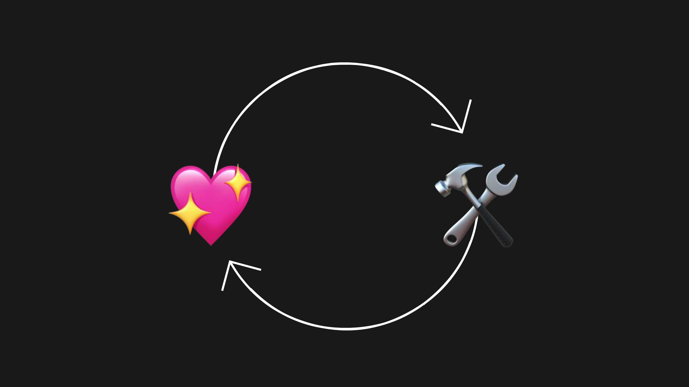

So, let's keep these three things in mind, and yes this is the recap summary slide:

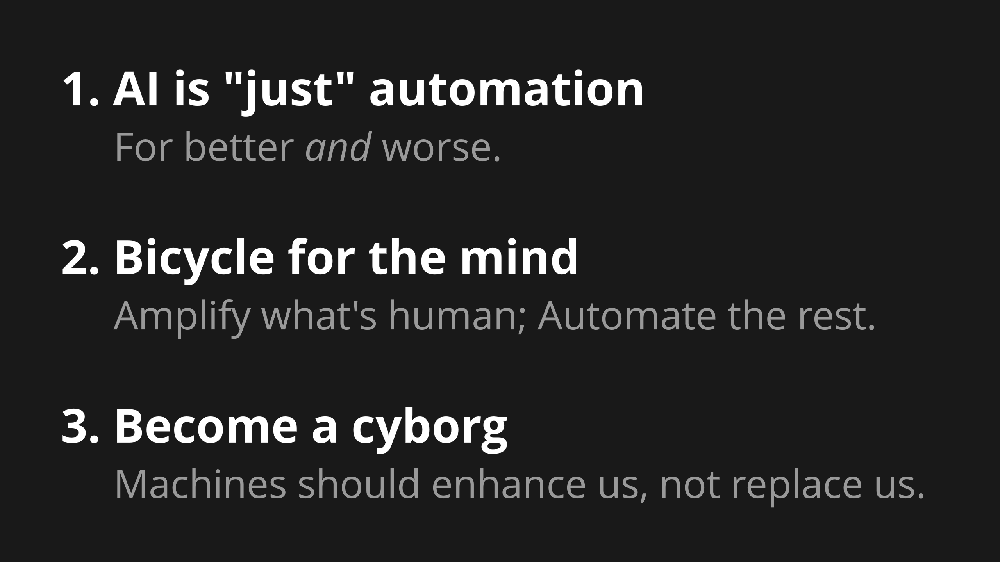

As long as we look directly at this scary dangerous problem, but with helpful lenses, we can figure this out!

And just maybe, we'll figure out how to steal that power, subvert it and healthily use it, without burning ourselves first.

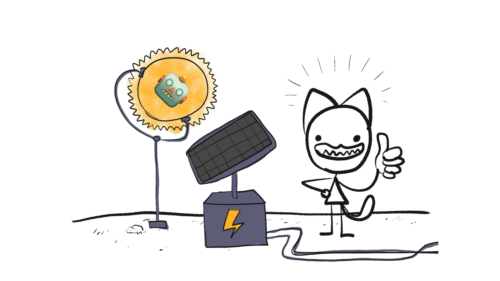

Thank you! `</END_TALK>`

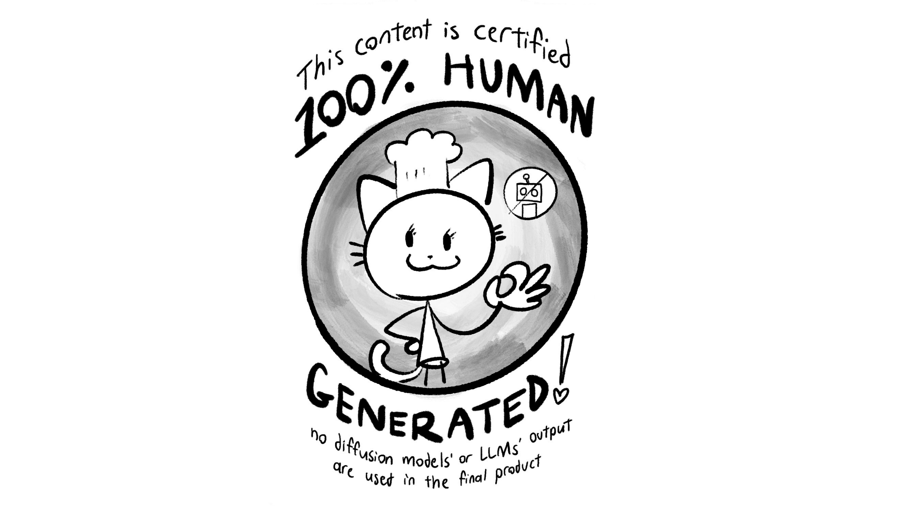

<iframe src="https://ncase.me/ncase-credits/signup.html" frameborder="no" width=640 height=200></iframe>

<iframe src="https://ncase.me/ncase-credits/supporters/sep2024.html" frameborder="no" width=640 height=640></iframe>